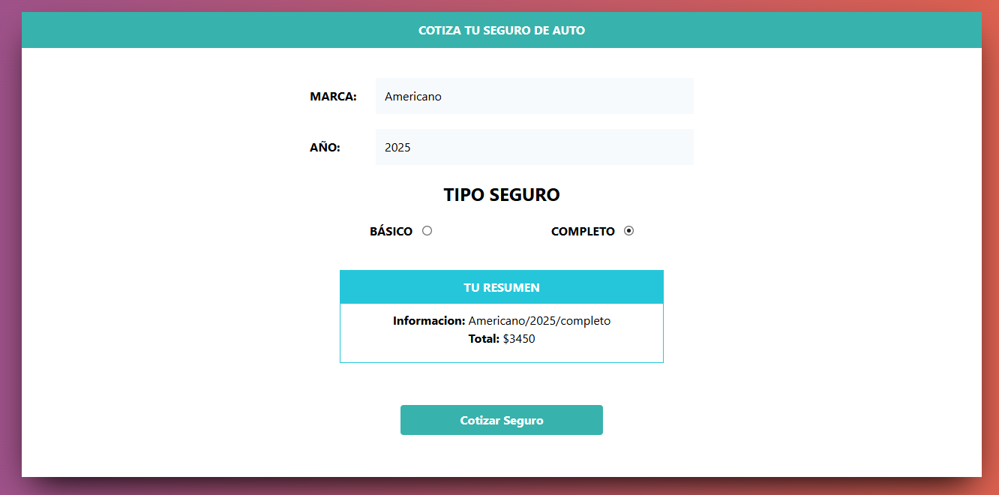

# Cotización de Seguros

Este proyecto permite calcular el costo de un seguro basado en la marca del vehículo, el año de fabricación y el tipo de cobertura.

## 📚 ¿Qué aprendí?

### Programación Orientada a Objetos (POO)

- En este proyecto se usaron **constructores** y **prototipos**, como se hacía antes de la introducción de `class` en ES6. Este enfoque ayuda a entender cómo funcionaban los objetos en JavaScript antes de la sintaxis moderna.

- Implementación de **métodos en el prototipo** para evitar que cada instancia tenga su propia copia de los métodos, optimizando la memoria.

 ### 🚗 Características del Proyecto

Este proyecto permite calcular el costo de un seguro basado en la marca del vehículo, el año de fabricación y el tipo de cobertura.

Marca del vehículo:

- Americano: Precio intermedio.
- Asiático: Precio más bajo.
- Europeo: Precio más caro.

Año del vehículo: Cuanto menor sea el año, el precio se reduce un 3% por año de antigüedad.

Tipo de seguro:

- Básico: Aumenta un 30%.
- Completo: Aumenta un 50%.

  

