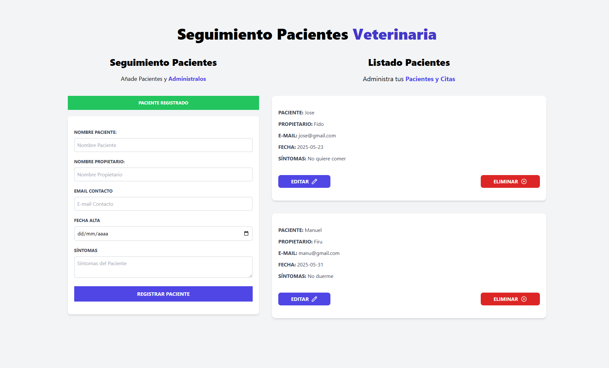

### 🐾 **Gestor de Citas para Veterinaria** – Proyecto en JavaScript

Este proyecto es una aplicación web que permite **gestionar citas de una veterinaria**. Los usuarios pueden registrar, editar y eliminar citas de pacientes (mascotas), ingresando datos como el nombre del animal, nombre del dueño, email, fecha de ingreso y una descripción de los síntomas.

#### 📌 Funcionalidades principales:

- Registro dinámico de citas con validación de campos.

- Edición de citas existentes con persistencia temporal en memoria.

- Eliminación de citas individuales.

- Generación única de identificadores para cada cita.

- Retroalimentación visual mediante alertas de éxito y error.

#### 🧠 **Lo que aprendí**

Durante el desarrollo de este proyecto, fortalecí varias habilidades clave en JavaScript:

- **Uso de Clases y Métodos:** Estructuré el código orientado a objetos para separar responsabilidades. Implementé clases como `AdminCitas` para gestionar la lógica principal (agregar, editar, eliminar y mostrar citas) y `Notificacion` para mostrar alertas. Esto me ayudó a evitar funciones sueltas y mantener un código más organizado y escalable.

- **Manipulación del DOM:** Aprendí a crear y actualizar dinámicamente elementos HTML desde JavaScript, con lógica para mostrar cada cita, así como botones para editar o eliminar.

- **Eventos y manejo de formularios:** Utilicé eventos como `submit` y `change` para recolectar los datos ingresados por el usuario y sincronizarlos en un objeto (`citaObj`). También entendí mejor el ciclo de vida de un formulario y cómo resetear datos tras cada operación.

- **Persistencia en memoria:** Comprendí que al trabajar con objetos en memoria, es necesario limpiar y reiniciar el estado del objeto después de cada uso para evitar errores o datos duplicados. Usé métodos como `Object.assign()` y `structuredClone()` para clonar y reiniciar datos sin afectar la referencia original.

- **Identificación única y edición:** Implementé una función de generación de IDs (`generarId`) para identificar cada cita. También aprendí cómo cargar los datos al formulario para editar correctamente una cita y cómo reemplazar los datos modificados en el array de citas.

#### 🛠️ Tecnologías utilizadas:

- **JavaScript (Puro)**

- **HTML5**

- **Tailwind CSS** para los estilos visuales

  

