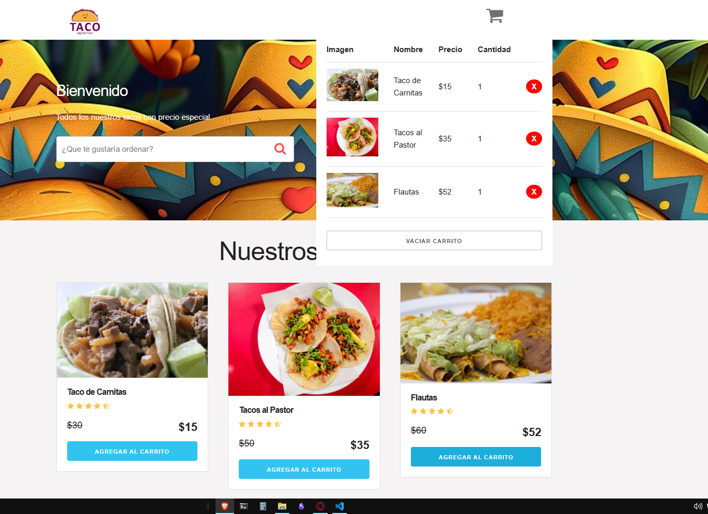

## 🛒 Carrito de Compras

Este es un carrito de compras básico desarrollado con **JavaScript, CSS y HTML**. Permite solo agregar y eliminar productos del carrito de compras.

### 🚀 Características
- Añadir productos al carrito.
- Eliminar productos del carrito.
- Actualizar la cantidad de productos seleccionados.

  

