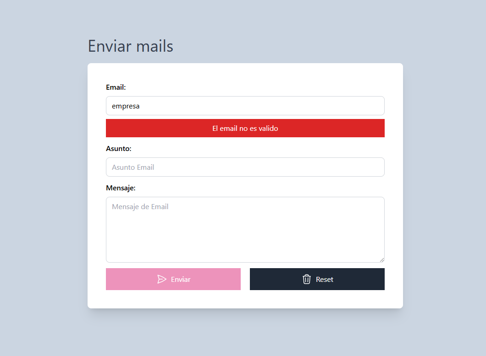

## ✉️ Formulario de Contacto

Este es un formulario de contacto desarrollado con **JavaScript, Tailwind CSS, CSS y HTML**. Valida los datos ingresados y asegura que todos los campos sean completados correctamente antes de permitir el envío.

### 🚀 Características
- Campos: **Email, Asunto y Mensaje**.
- Validación de **correo electrónico válido**.
- Verificación de que **ningún campo esté vacío**.
- Si hay campos vacíos, se muestra una **alerta** informando al usuario.
- El botón de **enviar se habilita solo cuando todos los campos están completos**.

  

