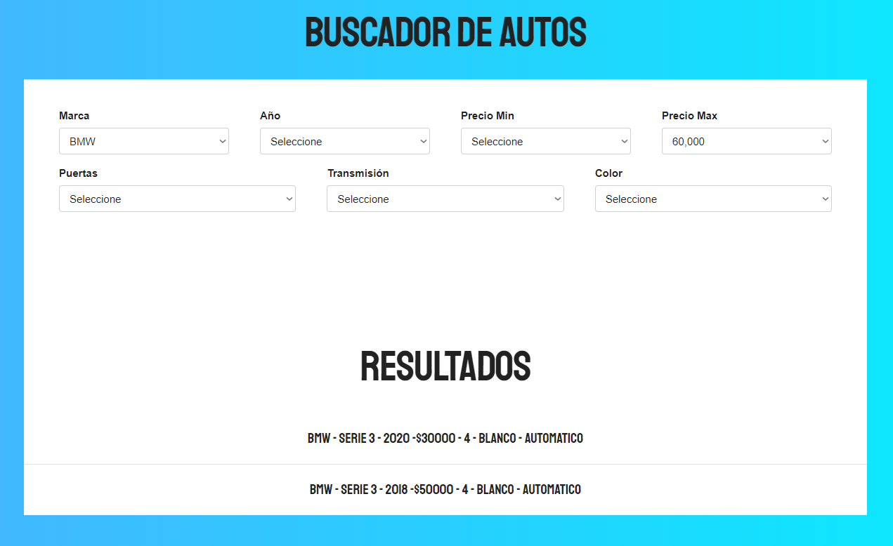

## 🚗 Proyecto de Filtrado de Automóviles

Este proyecto es un sistema que permite filtrar automóviles según diferentes criterios como color, modelo, año, puertas y transmisión. Si no se encuentra ningún resultado para la búsqueda, se muestra una alerta indicando que no hay coincidencias.

#### Tecnologías Utilizadas

- **HTML** para la estructura de la página.

- **CSS** y **Tailwind CSS** (como plantilla predefinida) para el diseño.

- **JavaScript** para la lógica del filtrado y la manipulación del DOM.

- **Archivo** `**db.js**` simulando una API con datos de automóviles.

### Características del Sistema

- Permite seleccionar diferentes criterios de búsqueda mediante `selects` en HTML.

- Se almacena la selección del usuario en un objeto `datosBusqueda`.

- Usa `filter()` en conjunto con operadores lógicos para aplicar múltiples criterios de búsqueda.

- Si la búsqueda tiene resultados, se muestran en pantalla; si no, aparece una alerta indicando que no hay coincidencias.

### Retos y Aprendizajes

Uno de mis principales retos fue aprender a usar `filter()` aplicando condiciones y operadores lógicos para refinar la búsqueda según los `selects` de HTML. También comprendí mejor la manipulación del DOM y cómo estructurar un código más dinámico.

### Posibles Mejoras

Sé que el código se puede optimizar más, pero este proyecto me sirvió mucho para profundizar en el tema y mejorar mis habilidades en JavaScript.

  

