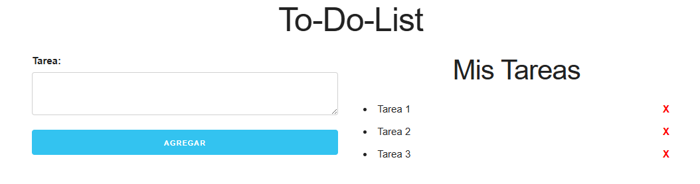

# ✅ To-Do List - Lista tus tareas

Este proyecto es una aplicación (To-Do-List) donde los usuarios pueden crear, visualizar y eliminar tareas. El propósito principal de este proyecto fue aprender a manejar **localStorage** en JavaScript para almacenar datos de forma persistente en el navegador. Esto permite que los posts no desaparezcan al recargar la página.

## 🚀 Funcionalidades

- Agregar un nueva nueva tarea.
- Listar las tareas creadas.
- Eliminar tareas.
- Persistencia de datos con `localStorage` para que los posts no se pierdan al recargar la página.

## 📚 ¿Qué aprendí?

Aparte de mejorar mi manejo del **DOM**, aprendí sobre **localStorage**, una API del navegador que permite almacenar información de la aplicación y simular una página web real con datos persistentes.

Uno de los conceptos clave que entendí es que, para guardar un **array** o un **objeto**, primero debo convertirlo en un **string** usando `JSON.stringify()`. Luego, al recuperar la información, debo transformarla de nuevo a su formato original con `JSON.parse()`.

Además, comprendí la importancia de **actualizar y repintar la información** en la interfaz cada vez que se modifica el almacenamiento, asegurando que el usuario siempre vea los datos correctos.

  

> **Nota**: En este proyecto se encontraran con clases con nombres que hacen referencia a twitter ya que la plantilla del proyecto inicialmente era con ese tema pero no le encontré mucha relación con  twitter así que lo deje como un simple To-Do-List.
